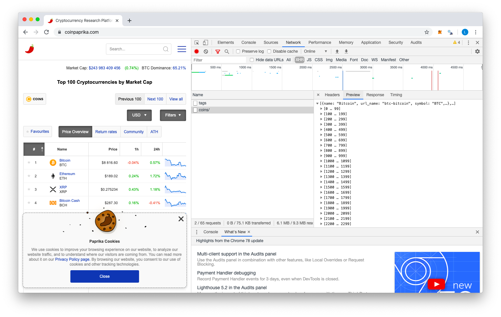
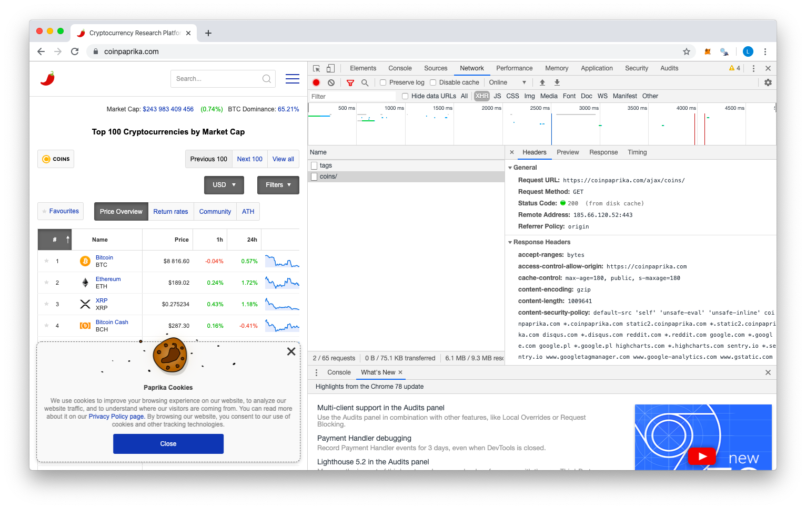

**Task: Choose a task from the excel:**
- Find a website, analyze the data source F12 network tab
- Find a json data source of the website, and make the POST or GET request
- Write a function that return with the processed data: Open every crypto and download into a whitepaper folder the whitepaers, process the details table. 
- Save it, with saverds

## R Setup
```{r setup, message = FALSE, warning=FALSE}
# setwd("~/Documents/Studium/Central European University (CEU)/Fall_Web Scraping/Assignment 2")
library(rvest)
library(stringr)
library(data.table)
library(httr)
library(jsonlite)
library(pbapply)
Sys.setenv(TZ='Europe/Berlin')

# Have your SelectorGadget on Google Chrome: https://selectorgadget.com/
```

I am going to scrape the website https://coinpaprika.com

Analyzing the data source with F12 and finding a json data source of the website:
```{r F12}


```

Saving URL
```{r URL}
my_coins_URL <- 'https://coinpaprika.com/ajax/coins/'
```

Write a function that return with the processed data, save it with saverds
```{r}
# read in details table
coins_table <- fromJSON(my_coins_URL, flatten = T)

saveRDS(coins_table, "coins_table.rds")
```


Open every crypto and download into a whitepaper folder the whitepaers, process the details table. 

```{r function}
# uses fromJSON instead of GET
download_WP <- function(coin) {
  
  #reads in page of coin
  coins_page <- read_html( paste0("https://coinpaprika.com/coin/",coin))
  
  # extracts link to whitepaper
  WP_link <- coins_page %>%
    html_node('.popup__whitepaper a')%>%
    html_attr('href')
  
  if (is.na(WP_link)) {
    print(paste0('No whitepaper available for ',coin))
    
  }else{
    print(paste0('Downloading whitepaper for ',coin))
    tryCatch({download.file(WP_link, paste0(getwd(), "/Whitepapers/", coin, '.pdf'))}, error=function(err) { warning("file could not be downloaded") })
    
#    download.file(WP_link, paste0(getwd(), "/Whitepapers/", coin, '.pdf'))
  }
}  
```

Run function on first 200 coins to download whitepapers
```{r run}
pblapply(coins_table$url_name[1:200], download_WP)
head(list.files(paste0(getwd(), "/Whitepapers/")))
```